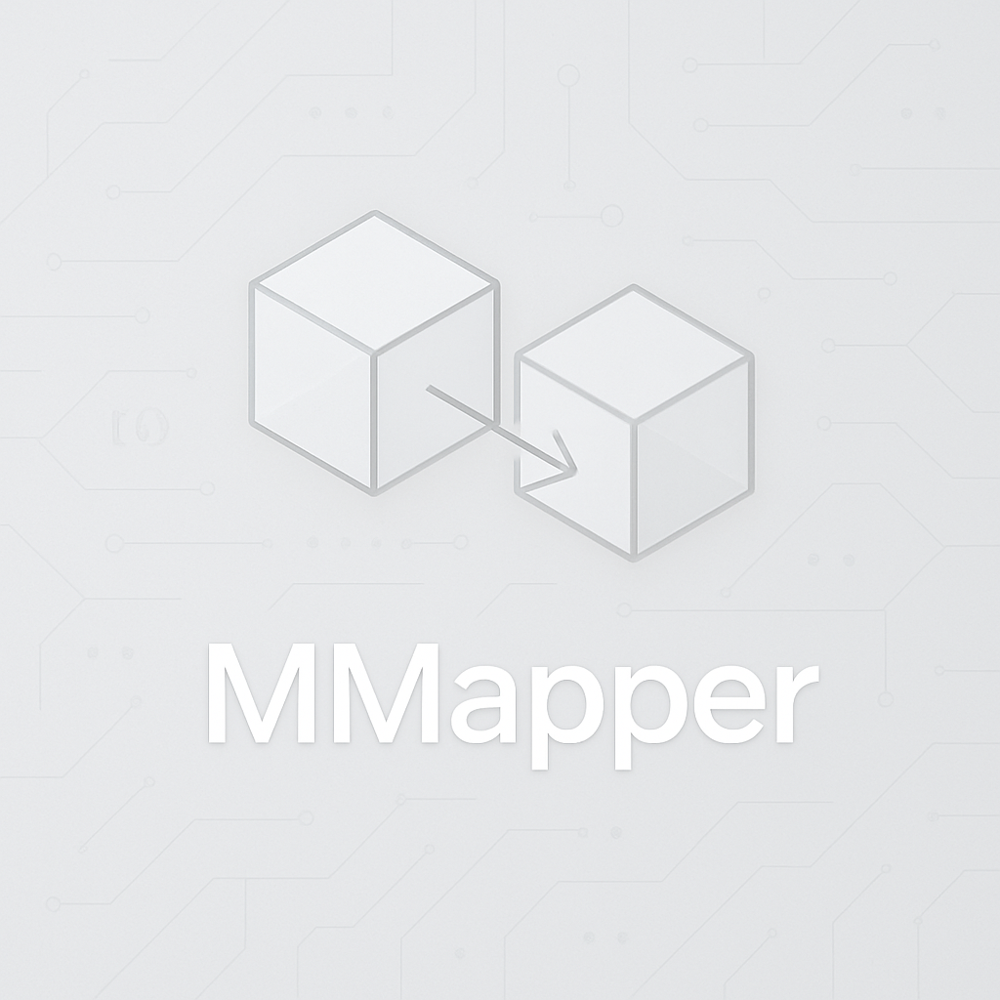

- atualmente disponivel para .net framework

Este repositório contém exemplos demonstrando as funcionalidades do **MMapper**, uma biblioteca de mapeamento de objetos em .NET. Ideal para quem busca uma alternativa leve e extensível para transformar objetos entre camadas da aplicação.

---

## 🧪 Exemplos de Possibilidades com o MMapper

---

### ✅ 1. Mapeamento Simples de Objetos

```csharp
public class UsuarioDto
{
    public string Nome { get; set; }
    public int Idade { get; set; }
}

public class UsuarioModel
{
    public string Nome { get; set; }
    public int Idade { get; set; }
}

var source = new UsuarioDto { Nome = "Carlos", Idade = 30 };
var destino = mapper.Map<UsuarioDto, UsuarioModel>(source);
```

---

### 🔄 2. Mapeamento com Renomeação de Propriedade

```csharp
public class ProdutoDto
{
    public string Titulo { get; set; }
}

public class ProdutoEntity
{
    public string NomeProduto { get; set; }
}

config.CreateMap<ProdutoDto, ProdutoEntity>(cfg =>
{
    cfg.ForMember("Titulo", "NomeProduto");
});

var produto = new ProdutoDto { Titulo = "Notebook Gamer" };
var entidade = mapper.Map<ProdutoDto, ProdutoEntity>(produto);
```

---

### 🔢 3. Conversão de Tipos - String para Inteiro

```csharp
public class PedidoDto
{
    public string NumeroPedido { get; set; }
}

public class PedidoEntity
{
    public int NumeroPedido { get; set; }
}

var pedido = new PedidoDto { NumeroPedido = "12345" };
var entidade = mapper.Map<PedidoDto, PedidoEntity>(pedido);
```

---

### 💾 4. Conversão Automática de byte[] para string

```csharp
public class BlobSource
{
    public byte[] Dados { get; set; }
}

public class TextoDestino
{
    public string Dados { get; set; }
}

var blob = new BlobSource { Dados = Encoding.UTF8.GetBytes("Documento secreto") };
var texto = mapper.Map<BlobSource, TextoDestino>(blob);

// texto.Dados => "Documento secreto"
```

---

### 🧱 5. Mapeamento de Objetos Aninhados (Nested Objects)

```csharp
public class ClienteDto
{
    public string Nome { get; set; }
    public EnderecoDto Endereco { get; set; }
}

public class EnderecoDto
{
    public string Cidade { get; set; }
}

public class ClienteModel
{
    public string Nome { get; set; }
    public EnderecoModel Endereco { get; set; }
}

public class EnderecoModel
{
    public string Cidade { get; set; }
}

config.CreateMap<ClienteDto, ClienteModel>();
config.CreateMap<EnderecoDto, EnderecoModel>();

var cliente = new ClienteDto
{
    Nome = "Julia",
    Endereco = new EnderecoDto { Cidade = "São Paulo" }
};

var model = mapper.Map<ClienteDto, ClienteModel>(cliente);
```

---

### 🔁 6. Mapeamento Reverso

```csharp
var destino = mapper.Map<Source, Destination>(source);
var novoSource = mapper.Map<Destination, Source>(destino);
```

---

### 📅 7. Conversão de DateTime para string

```csharp
public class Evento
{
    public DateTime DataEvento { get; set; }
}

public class EventoDto
{
    public string DataEvento { get; set; }
}

var evento = new Evento { DataEvento = DateTime.Now };
var eventoDto = mapper.Map<Evento, EventoDto>(evento);

// eventoDto.DataEvento => "2025-04-28T13:45:00" (exemplo)
```

---

### 🚫 8. Ignorar Propriedades

O MMapper ignora automaticamente propriedades que não possuem correspondência de nomes.

> 💡 Sugestão futura: adicionar suporte explícito via `Ignore()` em `ForMember`.

---

### ⚙️ 9. Conversões Personalizadas Complexas

```csharp
config.CreateMap<Source, Destination>(cfg =>
{
    cfg.ForMember("Cpf", "CpfComMascara");
});
```

Exemplo fictício: aqui você poderia aplicar lógica extra para mascarar o CPF durante o mapeamento.

---

### 📚 10. Mapeamento de Listas de Objetos

```csharp
List<Source> listaSource = new List<Source> 
{ 
    new Source { Nome = "João" }, 
    new Source { Nome = "Maria" } 
};

List<Destination> listaDestino = listaSource
    .Select(src => mapper.Map<Source, Destination>(src))
    .ToList();
```

---

## 🤝 Contribuições

Contribuições são bem-vindas! Se você tem exemplos adicionais ou melhorias para sugerir, abra uma issue ou envie um pull request.

---

## 📜 Licença

Este projeto está licenciado sob a MIT License.

---

## 👨‍💻 Autor

Feito com 💙 por Maximiliano Tarigo.
